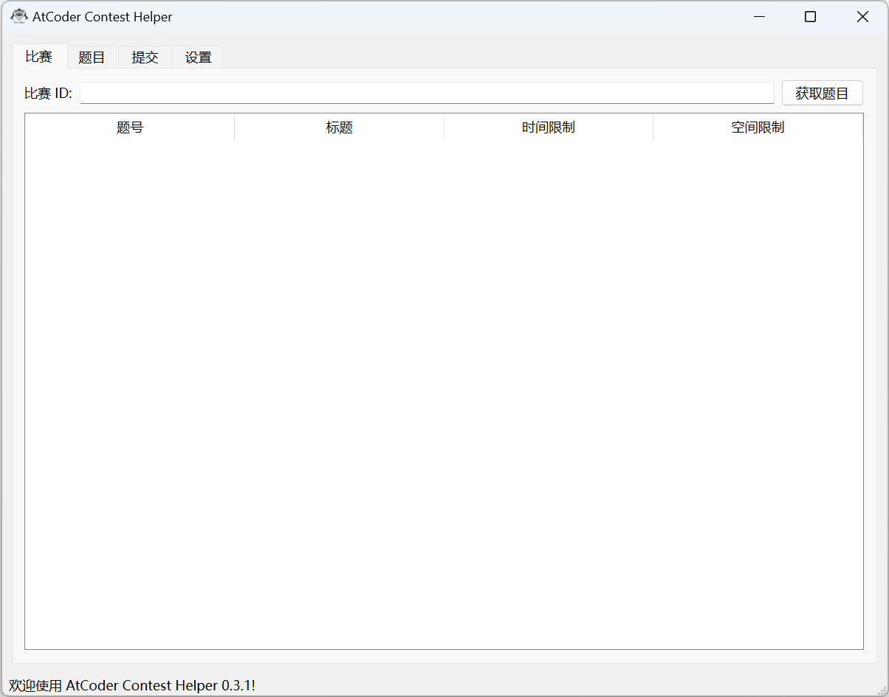

**由于 AtCoder 近期加入的 Cloudflare 验证，ACHelper 已经无法正常使用，故仓库转入 Archive。见 [https://atcoder.jp/posts/1457](https://atcoder.jp/posts/1457)。**

 

# AtCoder Contest Helper

AtCoder 比赛助手。**暂时只有中文版。**/ This project is currently **Chinese-only**.

仓库地址：[https://github.com/GoodCoder666/ACHelper](https://github.com/GoodCoder666/ACHelper)

Gitee 镜像地址：[https://gitee.com/goodcoder666/ACHelper](https://gitee.com/goodcoder666/ACHelper)

## 屏幕截图



## 快速上手

### 下载构建好的程序运行（支持Windows、MacOS）

从[Releases](https://github.com/GoodCoder666/ACHelper/releases)页面下载最新版的AtCoder Contest Helper，直接运行即可。

### 从源代码运行

克隆存储库：

```shell
git clone https://github.com/GoodCoder666/ACHelper.git
cd ACHelper

# 网络情况不好可以选择用Gitee镜像：
git clone https://gitee.com/goodcoder666/ACHelper.git
cd ACHelper
```

安装依赖项：

```shell
pip install -r requirements.txt
```

运行程序：

```shell
python3 main.py
```

（Windows下请使用`py main.py`）

## API

API 文档参见[apidocs.md](./apidocs.md)。

## 特别鸣谢

- AtCoder 官网：[https://atcoder.jp/](https://atcoder.jp/)
- 项目灵感来源于[CCHv2](https://github.com/CodeforcesContestHelper/CCHv2)（Codeforces Contest Helper）项目，在此特别感谢。

## Star History

[](https://star-history.com/#GoodCoder666/ACHelper)
